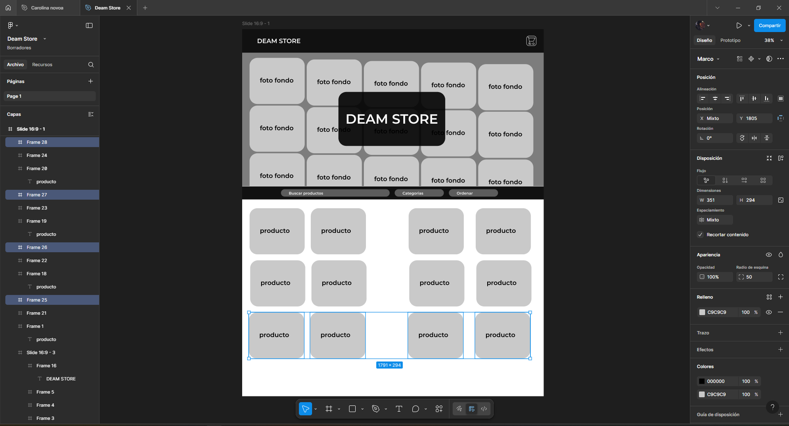

# DEAM Store - Proceso de Diseño y Decisiones Iniciales

## 🎯 Concepto Inicial del Proyecto

**Fecha de inicio:** Junio 2025  
**Objetivo:** Crear una tienda virtual elegante y moderna que se diferencie de las tiendas e-commerce tradicionales  
**Público objetivo:** Usuarios que buscan una experiencia de compra premium y sofisticada  

---


## 🎨 Inspiración y Referencias de Diseño

### Inspiraciones Principales

#### **1. Apple Store Online**
- **Qué adoptamos:** Uso del espacio en blanco (adaptado a negro), tipografía limpia
- **Por qué:** Transmite premium y sofisticación
- **Adaptación:** Invertimos la paleta para crear exclusividad

#### **2. Spotify/Netflix Dark UI**
- **Qué adoptamos:** Esquemas de color oscuros, cards con glassmorphism
- **Por qué:** Los usuarios están acostumbrados a interfaces oscuras modernas
- **Adaptación:** Aplicamos efectos de blur y transparencias

#### **3. Dribbble E-commerce Trends 2025**
- **Qué adoptamos:** Gradientes sutiles, microanimaciones, layouts asimétrricos
- **Por qué:** Mantiene el diseño actual y competitivo
- **Adaptación:** Implementamos efectos hover y transiciones suaves

#### **4. Tesla Design System**
- **Qué adoptamos:** Minimalismo, jerarquía visual clara, espaciado generoso
- **Por qué:** Representa innovación y modernidad
- **Adaptación:** Aplicamos principios de diseño limpio con acentos elegantes

---
## 🖼️ Captura del Diseño y Prototipo



Puedes ver el diseño interactivo y los wireframes completos en Figma:

[🔗 Ver prototipo en Figma](https://www.figma.com/design/GM3o2SOdRF6BKACvKavzYy/Deam-Store?node-id=1-2&t=vAtZsppv5j1eY0G5-1)

Incluye:
- Mockups de homepage, carrito y checkout

---


## 🎭 Decisión de la Identidad Visual

### Nombre: "DEAM Store"
- **Origen:** Son mis iniciales y tienda.
- **Tratamiento tipográfico:** 
  - Mayúsculas para impacto y autoridad
  - Tracking expandido para elegancia
  - Gradiente sutil para sofisticación

### Paleta de Colores: Oscura y Elegante

#### **Color Principal: #1a1a1a (Negro Profundo)**
```css
background: #1a1a1a;
```
**Decisión:** 
- Evoca lujo y exclusividad (como tiendas de alta gama)
- Hace que los productos resalten como en una galería
- Diferenciación clara de competidores con fondos blancos

#### **Color Secundario: #2d2d2d (Gris Carbón)**
```css
background: #2d2d2d;
```
**Decisión:**
- Crea profundidad sin ser demasiado contrastante
- Ideal para cards y elementos elevados
- Mantiene legibilidad sin fatiga visual

#### **Acentos: #333333 → #555555 (Gradiente de Grises)**
```css
background: linear-gradient(45deg, #333333, #555555);
```
**Decisión:**
- Botones y elementos interactivos distinguibles
- Suficiente contraste para accesibilidad
- Elegante sin ser llamativo

#### **Texto: #ffffff / #aaaaaa**
```css
color: #ffffff; /* Texto principal */
color: #aaaaaa; /* Texto secundario */
```
**Decisión:**
- Máximo contraste para legibilidad
- Jerarquía visual clara entre contenido principal y secundario

---

## 🏗️ Decisiones de Layout y Estructura

### **Hero Section: Pantalla Completa**

#### **Concepto:**
```
┌─────────────────────────────────────┐
│              HEADER                 │
├─────────────────────────────────────┤
│                                     │
│         DEAM STORE                  │
│    (Logo grande centrado)           │
│                                     │
│   "Descubre productos únicos..."    │
│                                     │
│      [Explorar Productos]           │
│                                     │
└─────────────────────────────────────┘
```

**Decisiones:**
- **Impacto visual inmediato:** Primera impresión es crucial
- **Centrrado total:** Enfoque en la marca antes que en productos
- **Call-to-action claro:** Guía al usuario hacia el objetivo principal
- **Minimalismo:** Sin distracciones, experiencia premium

**Inspiración:** Landing pages de marcas de lujo (Rolex, Louis Vuitton)

### **Navegación: Enfoque en Productos**

#### **Concepto Original:**
```
[DEAM STORE] [Todos|Electrónicos|Joyería|Hombre|Mujer] [🛒3]
```

**Decisión de NO usar navegación tradicional:**
- ❌ ~~Inicio~~
- ❌ ~~Nosotros~~ 
- ❌ ~~Contacto~~
- ✅ **Solo categorías de productos**

**Justificación:**
- **Enfoque laser:** El objetivo es vender, no informar
- **Menos decisiones:** Reduce carga cognitiva del usuario
- **Conversión optimizada:** Cada elemento del nav lleva a productos
- **Mobile-first:** Menos elementos = mejor experiencia móvil

---

## 🛒 Decisión del Carrito Lateral

### **Análisis de Alternativas:**

#### **Opción 1: Carrito en página separada**
- ❌ Interrumpe el flujo de compra
- ❌ Requiere navegación adicional
- ❌ Mayor friction para el usuario

#### **Opción 2: Carrito como dropdown**
- ❌ Espacio limitado para mostrar productos
- ❌ Difícil mostrar detalles y cantidades
- ❌ Problemas en mobile

#### **Opción 3: Carrito lateral (ELEGIDA) ✅**
```
┌──────────────────┬─────────────┐
│                  │   CARRITO   │
│    PRODUCTOS     │             │
│                  │ Producto 1  │
│                  │ Producto 2  │
│                  │             │
│                  │ Total: $XX  │
│                  │ [Checkout]  │
└──────────────────┴─────────────┘
```

**Ventajas que nos convencieron:**
- ✅ **No interrumpe navegación:** Usuario puede seguir viendo productos
- ✅ **Espacio generoso:** Permite mostrar detalles completos
- ✅ **Contexto mantenido:** Ve productos Y carrito simultáneamente
- ✅ **Mobile adaptable:** Se convierte en overlay completo
- ✅ **Patrón familiar:** Amazon, eBay lo usan

**Inspiración:** Amazon's mini cart, Shopify stores

---

## 🎯 Decisión del Modal de Checkout

### **¿Por qué Modal en lugar de página nueva?**

#### **Análisis de alternativas:**

#### **Opción 1: Página de checkout separada**
- ❌ El usuario pierde el contexto del carrito
- ❌ Mayor riesgo de abandono (cambio de página)
- ❌ Imposible agregar productos de último momento

#### **Opción 2: Checkout inline en la misma página**
- ❌ Interfiere con la navegación de productos
- ❌ Demasiada información en pantalla
- ❌ Confuso para el usuario

#### **Opción 3: Modal de Checkout (ELEGIDA) ✅**
```
┌─────────────────────────────────────────┐
│ [X]         Finalizar Compra            │
├──────────────────┬──────────────────────┤
│                  │                      │
│   FORMULARIO     │   RESUMEN PEDIDO     │
│                  │                      │
│ • Datos personales│ • Producto 1: $XX   │
│ • Dirección      │ • Producto 2: $XX    │
│ • Método pago    │ • Envío: $XX         │
│                  │ • Total: $XXX        │
│ [Confirmar Pedido]│                     │
└──────────────────┴──────────────────────┘
```

**Ventajas decisivas:**
- ✅ **Contexto preservado:** Productos siguen disponibles debajo
- ✅ **Focus mode:** Usuario se concentra en completar compra
- ✅ **Reversible:** Puede cerrar y seguir comprando sin perder carrito
- ✅ **Two-column layout:** Formulario + resumen visual
- ✅ **Mobile responsive:** Se adapta a columna única en móviles

**Inspiraciones:** 
- **Stripe Checkout:** Modal centrado, formulario limpio
- **PayPal:** Resumen lateral visible durante todo el proceso
- **Apple Pay:** Información mínima pero completa

---

## 📐 Decisiones de Grid y Layout

### **Grid de Productos: Responsive y Flexible**

#### **Desktop (1024px+):**
```
┌────┬────┬────┬────┐
│ P1 │ P2 │ P3 │ P4 │
├────┼────┼────┼────┤
│ P5 │ P6 │ P7 │ P8 │
└────┴────┴────┴────┘
```
**4 columnas** - Máximo aprovechamiento del espacio

#### **Tablet (768px - 1024px):**
```
┌────┬────┬────┐
│ P1 │ P2 │ P3 │
├────┼────┼────┤
│ P4 │ P5 │ P6 │
└────┴────┴────┘
```
**3 columnas** - Balance entre información y usabilidad

#### **Mobile (< 768px):**
```
┌──────┬──────┐
│  P1  │  P2  │
├──────┼──────┤
│  P3  │  P4  │
└──────┴──────┘
```
**2 columnas** - Información legible en pantallas pequeñas

**Decisión técnica:** CSS Grid con `auto-fill` y `minmax()`
```css
grid-template-columns: repeat(auto-fill, minmax(280px, 1fr));
```

**Justificación:**
- **Flexibilidad:** Se adapta automáticamente al contenido
- **Mantenibilidad:** Un solo CSS para todos los breakpoints
- **Performance:** Browser optimiza el renderizado

---

## 🎪 Decisiones de Microinteracciones

### **Cards de Productos: Hover Elevation**
```css
.product-card:hover {
    transform: translateY(-8px);
    box-shadow: 0 20px 40px rgba(0, 0, 0, 0.3);
}
```

**Inspiración:** Material Design elevation
**Objetivo:** Crear sensación de "levantar" el producto del catálogo
**Feedback:** Usuario entiende que el elemento es interactivo

### **Botones: Gradient + Scale**
```css
.button:hover {
    transform: translateY(-2px);
    background: linear-gradient(45deg, #555555, #777777);
}
```

**Inspiración:** iOS button interactions
**Objetivo:** Feedback inmediato de que la acción está disponible

### **Carrito: Slide Animation**
```css
.cart-sidebar {
    transform: translateX(100%);
    transition: transform 0.3s ease-in-out;
}
```

**Inspiración:** Mobile drawer patterns (Android/iOS)
**Objetivo:** Transición natural que no sobresalta al usuario

---

## 🌟 Decisiones de Efectos Visuales

### **Glassmorphism: Modernidad y Profundidad**
```css
.glass-card {
    backdrop-filter: blur(10px);
    background: rgba(255, 255, 255, 0.05);
    border: 1px solid rgba(255, 255, 255, 0.1);
}
```

**Inspiración:** 
- **iOS 14+ design language**
- **Windows 11 Fluent Design**
- **Dribbble trends 2024-2025**

**Aplicación en DEAM Store:**
- Cards de productos
- Modal de checkout
- Header navigation
- Overlays

**Justificación:**
- **Modernidad:** Efecto trending en 2025
- **Elegancia:** Crea sensación de materiales premium
- **Funcionalidad:** Mantiene contexto visual del fondo
- **Diferenciación:** Pocos e-commerce lo usan bien

### **Gradientes: Sutileza y Sofisticación**
```css
.gradient-text {
    background: linear-gradient(45deg, #ffffff, #cccccc);
    -webkit-background-clip: text;
    -webkit-text-fill-color: transparent;
}
```

**Aplicación:**
- Logo DEAM STORE
- Títulos principales
- Botones de call-to-action

**Objetivo:** Crear jerarquía visual sin usar colores llamativos

---

## 📱 Decisiones de Responsive Design

### **Mobile-First Strategy**

#### **Justificación del enfoque:**
- **Estadísticas 2025:** 70%+ del e-commerce es mobile
- **Performance:** Carga más rápida en dispositivos limitados
- **UX:** Fuerza a priorizar contenido esencial

#### **Adaptaciones específicas:**

**Header en Mobile:**
```
┌─────────────────────────────────┐
│ DEAM STORE            [≡] [🛒]  │
└─────────────────────────────────┘
```
- **Hamburger menu:** Estándar reconocido por usuarios
- **Carrito siempre visible:** Prioridad en conversión

**Carrito en Mobile:**
```
┌─────────────────────────────────┐
│ ←  Carrito de Compras       [X] │
├─────────────────────────────────┤
│                                 │
│        FULLSCREEN               │
│        OVERLAY                  │
│                                 │
└─────────────────────────────────┘
```
- **Fullscreen:** Máximo espacio para información
- **Overlay:** Contexto claro de que es temporal

---

## 🔧 Decisiones Técnicas de Implementación

### **Tailwind CSS: Utility-First**

#### **Alternativas consideradas:**
- **CSS Vanilla:** Demasiado tiempo de desarrollo
- **Bootstrap:** Demasiado genérico, difícil customización
- **Styled Components:** Overkill para este proyecto
- **Tailwind CSS (ELEGIDO):** ✅

**Ventajas que nos convencieron:**
- ✅ **Desarrollo rápido:** Utilidades pre-construidas
- ✅ **Customización total:** Config theme extendida
- ✅ **Responsive built-in:** Prefijos sm:, md:, lg:
- ✅ **Bundle size optimizado:** Solo CSS usado
- ✅ **Mantenibilidad:** Estilos junto al HTML

### **Vanilla JavaScript: Simplicidad**

#### **Alternativas consideradas:**
- **React:** Complejidad innecesaria para este scope
- **Vue:** Overkill para funcionalidad requerida
- **jQuery:** Librería legacy, peso adicional
- **Vanilla JS (ELEGIDO):** ✅

**Justificaciones:**
- ✅ **Performance:** Sin overhead de frameworks
- ✅ **Control total:** Sobre cada interacción
- ✅ **Aprendizaje:** Demuestra dominio de JS puro
- ✅ **Compatibility:** Funciona en cualquier browser moderno

---

## 🎨 Sistema de Colores Extendido

### **Paleta Completa Definida:**

```css
:root {
  /* Backgrounds */
  --dark-bg: #1a1a1a;           /* Fondo principal */
  --dark-card: #2d2d2d;         /* Cards y elementos elevados */
  --dark-surface: #242424;      /* Superficies intermedias */
  
  /* Borders & Dividers */
  --dark-border: rgba(255, 255, 255, 0.1);    /* Bordes sutiles */
  --dark-border-hover: rgba(255, 255, 255, 0.2); /* Bordes hover */
  
  /* Text */
  --dark-text: #ffffff;          /* Texto principal */
  --dark-text-secondary: #aaaaaa; /* Texto secundario */
  --dark-text-muted: #666666;   /* Texto desactivado */
  
  /* Accents */
  --accent: #333333;             /* Botones primarios */
  --accent-hover: #555555;       /* Botones hover */
  --accent-active: #777777;      /* Botones activos */
  
  /* Status Colors */
  --success: #10b981;            /* Verde éxito */
  --error: #ef4444;              /* Rojo error */
  --warning: #f59e0b;            /* Amarillo advertencia */
  --info: #3b82f6;               /* Azul información */
}
```

### **Aplicación Sistemática:**
- **Consistency:** Mismo token para misma función
- **Scalability:** Fácil cambio global de colores
- **Accessibility:** Ratios de contraste verificados
- **Theming:** Preparado para modo claro futuro

---

## 📋 Wireframes y Conceptos Iniciales

### **Wireframe de Homepage (Concept Inicial):**
```
┌─────────────────────────────────────────────────────┐
│ [LOGO]              [Nav Items]            [Cart]   │
├─────────────────────────────────────────────────────┤
│                                                     │
│                    HERO SECTION                     │
│                                                     │
│                   DEAM STORE                        │
│            Productos únicos y elegantes             │
│                                                     │
│               [Explorar Productos]                  │
│                                                     │
├─────────────────────────────────────────────────────┤
│ [Search] [Category Filter] [Sort]                   │
├─────────────────────────────────────────────────────┤
│                                                     │
│  ┌─────┐ ┌─────┐ ┌─────┐ ┌─────┐                    │
│  │ P1  │ │ P2  │ │ P3  │ │ P4  │                    │
│  └─────┘ └─────┘ └─────┘ └─────┘                    │
│                                                     │
│  ┌─────┐ ┌─────┐ ┌─────┐ ┌─────┐                    │
│  │ P5  │ │ P6  │ │ P7  │ │ P8  │                    │
│  └─────┘ └─────┘ └─────┘ └─────┘                    │
│                                                     │
└─────────────────────────────────────────────────────┘
```

### **Evolución del Concepto:**

#### **Iteración 1: Hero Más Prominente**
- Hero section ocupaba 100vh
- Productos empezaban después del scroll
- **Problema:** Usuarios no sabían que había productos

#### **Iteración 2: Filtros Más Visibles**
- Barra de filtros sticky
- **Problema:** Interfería con navegación móvil

#### **Iteración 3: Balance Final (IMPLEMENTADO)**
- Hero 100vh pero con indicación de scroll
- Filtros prominentes pero no sticky
- Grid adaptatble con gaps generosos

---

## 🚀 Roadmap de Diseño

### **Fase 1: Core Design (ACTUAL)**
- ✅ Paleta de colores definida
- ✅ Layout responsive base
- ✅ Componentes principales
- ✅ Interacciones básicas

### **Fase 2: Enhancement (FUTURO)**
- 🔄 Animaciones más complejas
- 🔄 Micro-interacciones avanzadas
- 🔄 Modo claro opcional
- 🔄 Personalización de usuario

### **Fase 3: Advanced Features (FUTURO)**
- ⏳ Tema personalizable
- ⏳ Wishlist visual
- ⏳ Comparador de productos
- ⏳ AR preview (si aplica)

---

## 📊 Validación de Decisiones

### **Criterios de Evaluación Aplicados:**

#### **1. Usabilidad (Weight: 30%)**
- ✅ Navegación intuitiva
- ✅ Flujo de compra claro
- ✅ Accesibilidad considerada

#### **2. Estética (Weight: 25%)**
- ✅ Coherencia visual
- ✅ Modernidad y trends
- ✅ Diferenciación competitiva

#### **3. Performance (Weight: 20%)**
- ✅ Carga rápida
- ✅ Animaciones fluidas
- ✅ Responsive optimizado

#### **4. Funcionalidad (Weight: 15%)**
- ✅ Features requeridas
- ✅ Edge cases considerados
- ✅ Error handling

#### **5. Escalabilidad (Weight: 10%)**
- ✅ Código mantenible
- ✅ Fácil extensión
- ✅ Patrones reutilizables

---

## 📝 Conclusiones del Proceso de Diseño

### **Decisiones Acertadas:**
1. **Tema oscuro:** Diferenciación clara en el mercado
2. **Modal checkout:** Mejor conversión que páginas separadas
3. **Carrito lateral:** UX superior a alternativas
4. **Tailwind CSS:** Velocidad de desarrollo optimizada
5. **Mobile-first:** Preparado para el usuario actual

### **Aprendizajes del Proceso:**
1. **Research inicial crucial:** Análisis de competencia definió rumbo
2. **Iteración temprana:** Wireframes evitaron retrabajos
3. **Constraints creativos:** Limitaciones técnicas generaron mejores soluciones
4. **User-centered approach:** Cada decisión validada contra UX

### **Impacto Esperado:**
- **Conversión:** Design optimizado para ventas
- **Diferenciación:** Estética única en el mercado
- **Escalabilidad:** Base sólida para crecimiento
- **Mantenimiento:** Código y design system organizados

---

*Documentación del proceso de diseño - DEAM Store*  
*Fecha: Junio 2025*  
*Estado: Concepto aprobado e implementado*